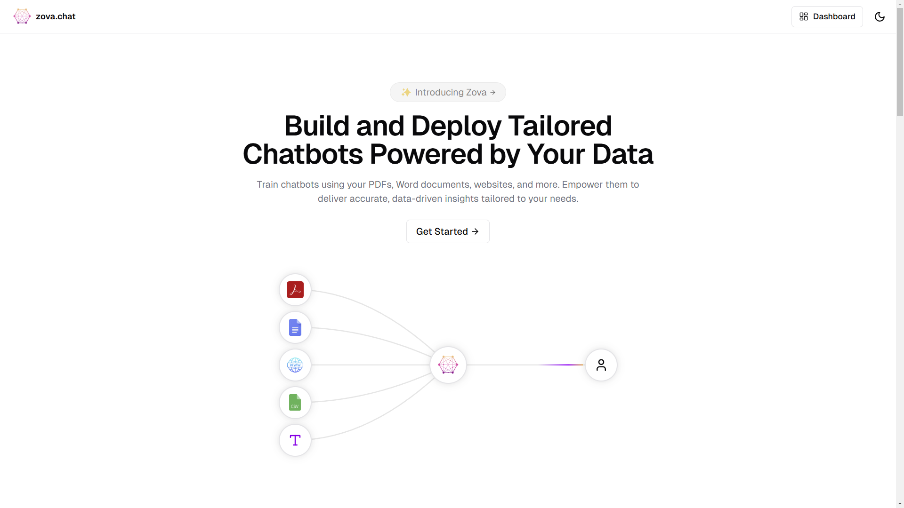

# Zova

Zova is SaaS platform that leverages the Retrieval-Augmented Generation (RAG) framework, allowing users to create multi-source chatbots. These chatbots are capable of retrieving facts from diverse sources, including PDFs, Word documents, websites and more, enhancing LLM performance and reliability. Additionally, Zova makes it easy to integrate these chatbots into your own websites with simple script tags.



## Features

- **Next.js Framework**: Fast and modern React-based framework for building server-side rendering and static web applications.
- **Langchain**: Utilizes Langchain for RAG framework.
- **Pinecone**: Utilizes Pinecone for vector database.
- **Database Management**: Integrated with Drizzle ORM and Neon for seamless database operations.
- **Authentication**: Utilizes Auth.js for secure and flexible authentication solutions.
- **Payment Integration**: Integrated with Stripe for handling payments and webhooks.
- **AWS S3**: Utilizes AWS SDK for S3 storage solutions.
- **Resend**: Utilizes Resend for email solutions.
- **UI**: Utilizes Shadcn/UI, Magic/UI, Lucide Icons and Tailwind CSS for UI components.

## Installation

### Prerequisites

- Node.js (latest version recommended)
- npm or yarn package manager

### Steps

1. Clone the repository:

   ```bash
   git clone https://github.com/umerarif01/zova.git
   cd zova
   ```

2. Install dependencies:

   ```bash
   npm install
   ```

3. Set up environment variables:
   Create a `.env` file in the root directory. Copy the `.env.example` file and fill in the variables.

4. Set up the database:
   Run Drizzle ORM migrations:

   ```
   npm run db:push
   ```

5. Run the development server:

   ```
   npm run dev
   ```

6. Run the ingest backend:

   clone the ingest backend from [here](https://github.com/umerarif01/zova-backend) and follow the instructions to run it.

## Contributing

Contributions are welcome! Please open an issue or submit a pull request for any bugs or feature requests.

## License

This project is licensed under the MIT License.

## Contact

For any inquiries or support, please open an issue in the repository.
